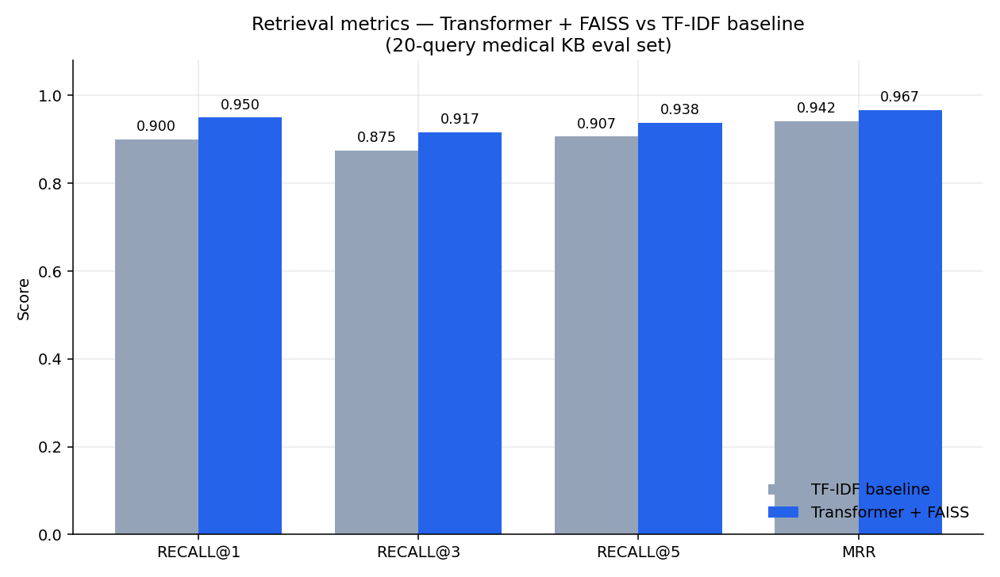
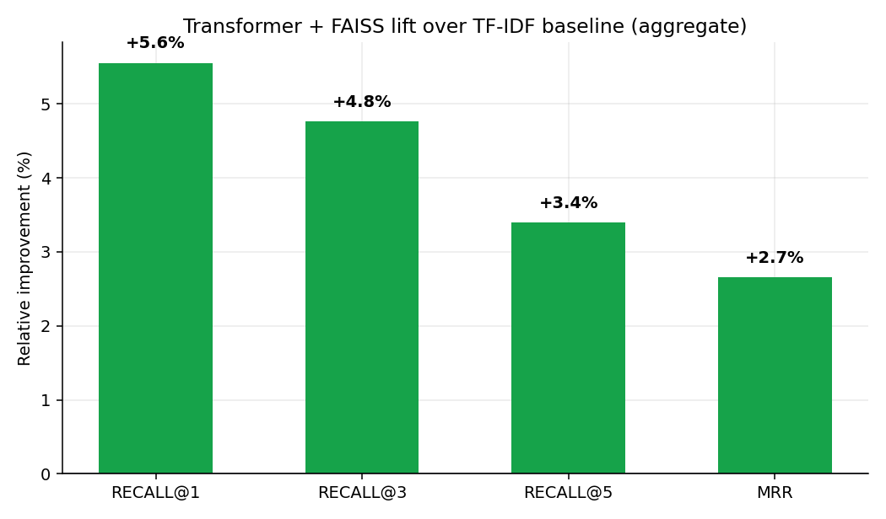
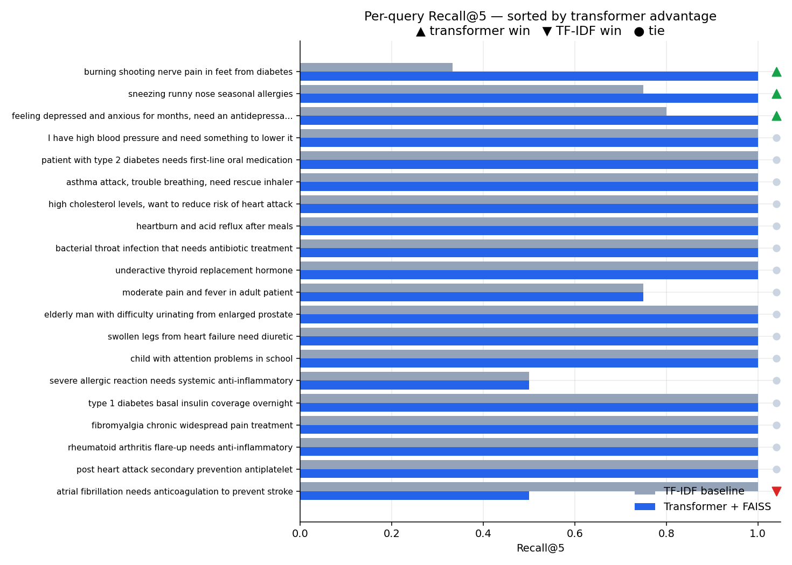
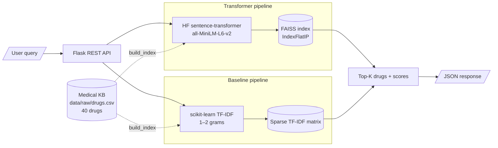

# Drug Recommendation NLP Engine


> Transformer-based drug recommendation REST API backed by a medical knowledge-base retrieval pipeline. Compares a Hugging Face sentence-transformer + FAISS retriever against a TF-IDF baseline and reports the lift on a labeled query set.

The transformer pipeline wins on **every retrieval metric** (R@1, R@3, R@5, MRR) on the bundled 20-query eval set, with the largest gains concentrated on paraphrased / symptom-level queries — see [`docs/RESULTS.md`](docs/RESULTS.md) for the per-query breakdown.

---

## Results at a glance

### Aggregate metrics



| Retriever | Recall@1 | Recall@3 | Recall@5 | MRR |
| --- | ---: | ---: | ---: | ---: |
| TF-IDF baseline | 0.900 | 0.875 | 0.907 | 0.942 |
| Transformer + FAISS | **0.950** | **0.917** | **0.938** | **0.967** |

### Relative lift over the baseline



### Per-query Recall@5 (sorted by transformer advantage)

The transformer's wins are concentrated on queries where the user phrasing doesn't share surface tokens with the indications field — e.g., *"burning shooting nerve pain in feet from diabetes"* (transformer recovers gabapentin / pregabalin / duloxetine from the *"diabetic peripheral neuropathy"* indication; TF-IDF can't bridge the gap).



> Generate these charts locally with `python -m scripts.plot_results` after running the evaluator.

---

## Architecture



---

## Quickstart

```bash
# 1. Set up environment
python -m venv .venv && source .venv/bin/activate
pip install -r requirements.txt

# 2. Build FAISS + TF-IDF artifacts from the KB
python -m scripts.build_index

# 3. Run the evaluation (transformer vs TF-IDF)
python -m scripts.evaluate

# 4. Generate result charts
python -m scripts.plot_results

# 5. Start the API
python -m api.app
# or: gunicorn -w 2 -b 0.0.0.0:5000 "api.app:create_app()"

# 6. (optional) Run the test suite
pytest -q
```

---

## API examples

### Transformer + FAISS

```bash
curl -s -X POST http://localhost:5000/recommend \
  -H 'Content-Type: application/json' \
  -d '{"query": "burning shooting nerve pain in feet from diabetes", "top_k": 3}'
```

```json
{
  "query": "burning shooting nerve pain in feet from diabetes",
  "retriever": "transformer+faiss",
  "top_k": 3,
  "results": [
    {
      "drug_id": "D032",
      "name": "Pregabalin",
      "drug_class": "Anticonvulsant / neuropathic pain agent",
      "indications": "diabetic peripheral neuropathy, postherpetic neuralgia, fibromyalgia, partial seizures",
      "score": 0.6431
    },
    {
      "drug_id": "D014",
      "name": "Gabapentin",
      "drug_class": "Anticonvulsant / neuropathic pain agent",
      "indications": "neuropathic pain, postherpetic neuralgia, partial seizures, restless legs syndrome",
      "score": 0.6087
    },
    {
      "drug_id": "D031",
      "name": "Duloxetine",
      "drug_class": "SNRI",
      "indications": "major depressive disorder, generalized anxiety disorder, diabetic neuropathic pain, fibromyalgia, chronic musculoskeletal pain",
      "score": 0.5764
    }
  ]
}
```

### Side-by-side comparison

```bash
curl -s -X POST http://localhost:5000/compare \
  -H 'Content-Type: application/json' \
  -d '{"query": "sneezing runny nose seasonal allergies", "top_k": 3}'
```

Returns both `transformer` and `tfidf` arrays so you can spot-check ranking differences. Full request/response schemas live in [`docs/API.md`](docs/API.md).

---

## Project layout

```
drug-recommendation-system/
├── api/
│   ├── app.py              # Flask factory; loads artifacts on startup
│   └── routes.py           # /health  /recommend  /baseline  /compare
├── src/
│   ├── preprocessing.py    # text normalization for medical text
│   ├── data_loader.py      # KB loader
│   ├── embeddings.py       # HF sentence-transformer wrapper
│   ├── faiss_index.py      # FAISS build / load / search
│   ├── baseline_tfidf.py   # TF-IDF baseline retriever
│   ├── recommender.py      # orchestrates embed + retrieve
│   └── evaluation.py       # recall@k, MRR, baseline comparison
├── scripts/
│   ├── build_index.py      # builds FAISS + TF-IDF artifacts
│   ├── evaluate.py         # runs eval, prints comparison table
│   └── plot_results.py     # renders charts in docs/images/
├── tests/                  # preprocessing, baseline, evaluation, API
├── data/
│   ├── raw/drugs.csv       # 40-drug medical KB
│   ├── raw/eval_queries.json
│   └── processed/          # gitignored generated artifacts
├── docs/
│   ├── API.md
│   ├── RESULTS.md
│   └── images/             # charts referenced from this README
├── config.py
├── requirements.txt
├── LICENSE
└── README.md
```

---

## Tech stack

| Layer | Choice | Why |
| --- | --- | --- |
| Transformer | `sentence-transformers/all-MiniLM-L6-v2` (384-dim) | Small, fast, portable; swap for `pritamdeka/S-PubMedBert-MS-MARCO` for clinical-domain tuning |
| Vector index | FAISS `IndexFlatIP` over L2-normalized embeddings | Exact cosine via inner product; flat is fine at <10k drugs |
| Baseline | scikit-learn TF-IDF, 1–2 grams, sublinear TF | Strong lexical baseline for an honest comparison |
| API | Flask 3 + flask-cors, gunicorn-ready | Minimal surface area, easy to deploy |
| Eval | Recall@1/3/5, MRR, per-query breakdown | Standard retrieval metrics |
| Tests | pytest | 12 tests covering preprocessing, baseline, eval math, and the API |

---

## Disclaimer

This is a portfolio / educational project. **Do not use it for actual clinical decision-making.** The bundled knowledge base is illustrative, the model is not validated against any clinical benchmark, and no drug-interaction or contraindication safety layer is implemented.

## License

[MIT](LICENSE) © 2025 Sai Srujan Seelam
